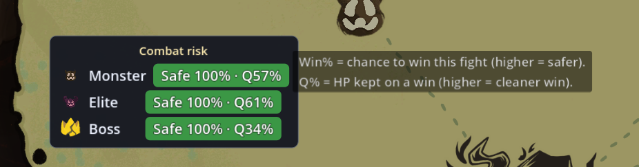

# StS2 Winrate Preview (승률 미리보기)

*[English README](README.md)*

**슬레이 더 스파이어 2 맵 오버레이** — 맵에서 노드를 고르기 *전에*, 다가올 **몬스터 / 엘리트 / 현재 막 보스**에 대한 전투 위험도 밴드(**안전 / 주의 / 위험**)와 **승률 %**, **전투 품질 %**를 띄워 줍니다.

이 수치는 휴리스틱이 아니라, **현재 덱·유물·포션·HP**로 **실제 STS2 전투 엔진을 별도 헤드리스 헬퍼 프로세스에서 시뮬레이션**해 산출합니다. **읽기 전용이며 게임 상태에 전혀 영향을 주지 않습니다.**

> ⚠️ **밴드는 예측일 뿐 승리를 보장하지 않습니다.** **100%**라도 승리를 보장하지 **않습니다** — AI가 현재 덱으로 *표본* 드로우/인카운터에 대해 플레이한 결과라, 전투가 *대체로* 어떻게 흘러가는지를 나타낼 뿐 *당신의* 이번 판을 보장하지는 않습니다. 실제 드로우·타겟팅·순간 판단에 따라 '안전' 전투도 질 수 있고 '위험' 전투도 이길 수 있습니다. **어디까지나 참고용으로만 보세요.**



## 특징
- 맵 화면에 다가올 카테고리별(몬스터 / 엘리트 / 현재 막 보스) 위험도 밴드 표시.
- **승률 %** + **전투 품질 %**(이겼을 때 남는 HP) 병기.
- 정적 수식이 아닌 **실제 전투 엔진 시뮬레이션**(롤아웃-개선 정책)을 헬퍼 풀에서 병렬 수행.
- 막 전체 인카운터 풀에 대해 집계하므로, 막을 진행해도 밴드가 안정적(덱·HP 변화만 반영).
- 드래그 이동·표시 토글 가능, 일시정지/설정 팝업 시 자동 숨김.
- 16개 언어. 패널에 마우스를 올리면 두 수치에 대한 간단한 설명이 뜹니다.

## 작동 방식
1. 번들된 헤드리스 헬퍼(`Sts2CombatCore`)가 **실제 게임 전투 엔진**을 별도 프로세스로 구동합니다.
2. 맵을 열면 모드가 현재 덱·유물·포션·HP를 **헬퍼 프로세스 풀**에 보내, 다가올 각 전투를 승/패까지 시뮬레이션합니다.
3. 전투당 약 1초 내로 밴드가 뜹니다. 사양이 좋을수록 헬퍼가 많아져 더 빠릅니다.

헬퍼는 **롤아웃-개선 "search" 정책**으로 플레이하며, 손튜닝 플래너로 floor를 보장해 추정치가 절대 플래너보다 낮아지지 않습니다.

## 설치
1. STS2 모드 로더가 설치돼 있어야 합니다.
2. 릴리즈 zip을 게임 `mods/` 폴더에 풀어 아래 구조가 되게 합니다:
   ```
   <게임>/mods/Sts2WinratePreview/Sts2WinratePreview.dll
   <게임>/mods/Sts2WinratePreview/Sts2WinratePreview.json
   <게임>/mods/Sts2WinratePreview/helper/Sts2CombatCore.exe   (+ 런타임 파일)
   ```
3. 게임을 실행하고 런을 시작하면 맵 화면에 밴드가 나타납니다.

## 설정 (선택 — 환경 변수)
| 변수 | 기본값 | 효과 |
|---|---|---|
| `STS2_WINRATE_HELPERS` | 자동 (≈ 물리 코어, RAM 상한, 2–16) | 병렬 헬퍼 프로세스 수. 많을수록 빠름. |
| `STS2_WINRATE_DECISION` | `search` | `search`(롤아웃-개선, 정확) 또는 `plannern`(빠름). |
| `STS2_WINRATE_QUERY_TIMEOUT_MS` | `60000` | 전투당 타임아웃(초과 시 헬퍼 재활용). |

## 참고
- 번들된 헬퍼는 자체 포함(self-contained, Windows x64)이라 별도 .NET 설치가 필요 없습니다.
- 헬퍼는 별도 프로세스라, 첫 맵 진입 시 한 번 워밍업합니다.
- `affects_gameplay: false` — 시뮬은 일회용 예측이며, 런을 자동 플레이하거나 수정하지 않습니다.
- 밴드는 내장 AI 수준의 플레이를 막 인카운터에 표본추출한 것 — 보장이 아닌 **참고용**으로 보세요.

## 제작 / 라이선스
- 제작자: **inggom**
- `Sts2CombatCore` 헤드리스 전투 엔진 기반.
